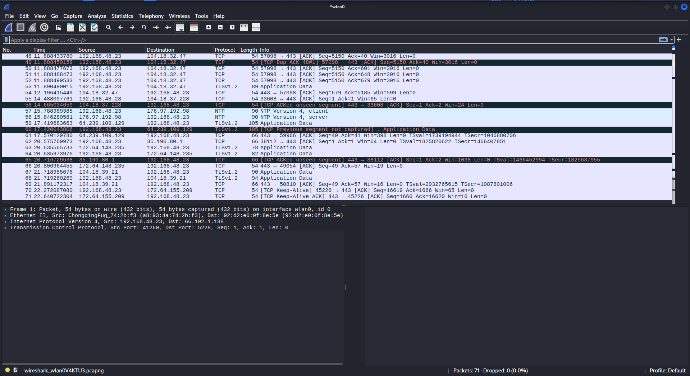
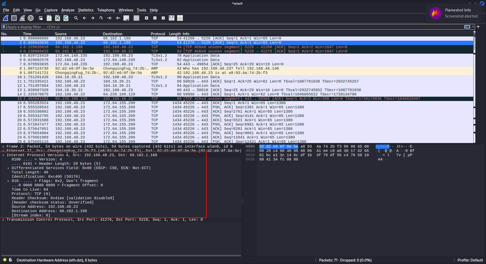
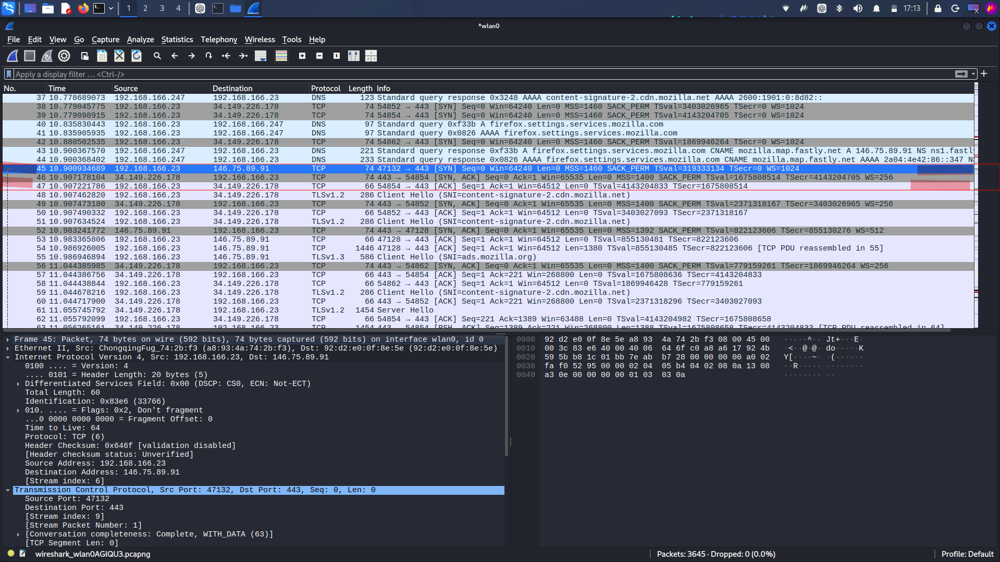

# Lab 1 --- Network Traffic & Packet Analysis with Wireshark

## Overview

This lab documents hands-on packet analysis performed on Kali Linux
using Wireshark.

The investigation progressed through the network stack:

**Ethernet → ARP → IPv4 → TCP → TLS**

The goal was to observe how these protocols appear in real traffic
rather than learning them only from theory.

## Environment

-   Operating system: Kali Linux
-   Packet analyzer: Wireshark 4.6.6
-   Capture interface: `wlan0`
-   Capture status observed: 71 packets, 0 dropped in the documented
    71-packet capture
-   Additional capture used for TLS analysis:
    `TCP and TLS Capture.pcapng`

## Objectives

-   Identify protocol layers inside captured traffic.
-   Distinguish MAC addressing from IP addressing.
-   Observe ARP request/reply behavior.
-   Inspect IPv4 fields including TTL.
-   Analyze TCP ports, flags, sequence numbers, and acknowledgments.
-   Capture and identify a TCP three-way handshake.
-   Inspect a TLS Client Hello carried over TCP.
-   Observe TCP reassembly of a larger TLS handshake message.

## 1. Ethernet and IPv4 Observation

A captured packet showed:

-   IPv4 source: `192.168.48.23`
-   IPv4 destination: `66.102.1.188`
-   IPv4 TTL: `64`
-   Ethernet source MAC: `a8:93:4a:74:2b:f3`
-   Ethernet destination MAC: `92:d2:e0:0f:8e:5e`

The capture demonstrated that Ethernet addressing is used for delivery
on the local link, while IPv4 provides the logical source and
destination addresses used for routing.

## 2. ARP Request and Reply

The capture contained an ARP exchange.

The request asked:

`Who has 192.168.48.23? Tell 192.168.48.140`

The request used the Ethernet broadcast address:

`ff:ff:ff:ff:ff:ff`

The ARP reply identified:

`192.168.48.23 is at a8:93:4a:74:2b:f3`

This demonstrated how ARP resolves an IPv4 address to a MAC address on a
local network.

## 3. TCP Traffic and Port Analysis

TCP traffic was observed using both ephemeral client ports and
destination port `443`.

Examples from the captures included:

-   `52302 → 443`
-   `47132 → 443`
-   `54854 → 443`

Port `443` is conventionally associated with HTTPS/TLS traffic, while
the higher-numbered source ports are client-side ephemeral ports.

A TLS Client Hello packet showed:

-   Source port: `52302`
-   Destination port: `443`
-   TCP sequence number: `1401`
-   TCP acknowledgment number: `1`
-   TCP segment length: `142 bytes`
-   TCP flags: `PSH, ACK`

## 4. TCP Three-Way Handshake

A separate capture provided direct evidence of the TCP three-way
handshake.

The documented sequence was:

  Packet   Direction                                   Flags        Relative Seq   Relative Ack
  -------- ------------------------------------------- ---------- -------------- --------------
  45       `192.168.166.23:47132 → 146.75.89.91:443`   SYN                     0            ---
  46       `146.75.89.91:443 → 192.168.166.23:47132`   SYN, ACK                0              1
  47       `192.168.166.23:47132 → 146.75.89.91:443`   ACK                     1              1

The SYN packet displayed a TCP window of `64240`, MSS `1460`, SACK
permitted, timestamps, and window scaling.

The sequence demonstrated how TCP establishes bidirectional state before
application data is exchanged.

## 5. TCP Sequence and Acknowledgment Analysis

During analysis of a TLS-carrying TCP segment, Wireshark displayed:

-   Relative sequence number: `1401`
-   TCP segment length: `142`
-   Next sequence number: `1543`

The calculation was:

`1401 + 142 = 1543`

Therefore, the segment carried bytes beginning at sequence position
`1401` and the next expected sequence position was `1543`.

This reinforced that TCP sequence numbers track the byte stream rather
than simply numbering packets.

## 6. TLS Client Hello

A captured packet was identified by Wireshark as:

`TLSv1.3 — Client Hello (SNI=chatgpt.com)`

Observed fields included:

-   IPv4 source: `192.168.166.23`
-   IPv4 destination: `172.64.155.209`
-   TCP source port: `52302`
-   TCP destination port: `443`
-   TLS handshake type: `Client Hello`
-   SNI: `chatgpt.com`
-   TLS Client Hello contained a key-share extension.
-   Wireshark showed the Client Hello as part of a reassembled TLS
    message.

The Client Hello demonstrates that TLS negotiation begins after the
underlying TCP connection has been established.

### Important version observation

Wireshark identified the packet as `TLSv1.3`, while the Client Hello
details displayed a legacy `Version: TLS 1.0` field.

This lab does **not** treat that legacy field as proof that the
connection negotiated TLS 1.0. The negotiated protocol version should
instead be established from the appropriate TLS version information,
such as the supported-versions extension and subsequent handshake
messages.

## 7. TCP Reassembly

Wireshark displayed:

`[2 Reassembled TCP Segments (1542 bytes): #56(1400), #57(142)]`

This showed that the TLS handshake message extended across more than one
TCP segment.

The capture therefore demonstrated an important relationship:

**Application-layer data can span multiple transport-layer segments, and
Wireshark can reassemble those segments for analysis.**

## 8. Troubleshooting

The first attempt to capture the TCP handshake did not contain the
beginning of the connection because the capture started after an
existing connection had already been established.

To obtain the required evidence, a fresh capture was started on `wlan0`,
new traffic was generated, and the resulting packets were filtered and
inspected.

This produced direct SYN → SYN/ACK → ACK evidence.

## Security Relevance

This lab established several foundations for defensive network analysis:

-   MAC addresses identify endpoints on the current Ethernet/Wi-Fi link.
-   IP addresses provide logical addressing across routed networks.
-   ARP connects local IPv4 addresses to link-layer MAC addresses.
-   TCP provides connection establishment, sequencing, acknowledgments,
    and reliable byte-stream delivery.
-   TLS protects application data while still exposing some connection
    and handshake metadata to a packet observer.
-   Packet reassembly is important when analyzing higher-layer protocols
    carried over TCP.
-   Wireshark can be used to move from raw packets to protocol-level
    security observations.

## Evidence

The `evidence/` directory contains screenshots captured during the
practical work.

No packet results or screenshots were fabricated for this documentation.
Values in this document are limited to observations visible in the
captured evidence and the practical analysis performed during the lab.

## Key Takeaways

1.  Network communication is layered rather than being one single
    protocol.
2.  MAC addressing and IP addressing solve different problems.
3.  ARP is used to resolve local IPv4-to-MAC mappings.
4.  TCP establishes a connection before carrying application data.
5.  TCP sequence numbers represent positions in a byte stream.
6.  TLS Client Hello messages contain negotiation metadata but do not
    expose the resulting private session secrets.
7.  A single higher-layer message can be split across multiple TCP
    segments and later reassembled.
